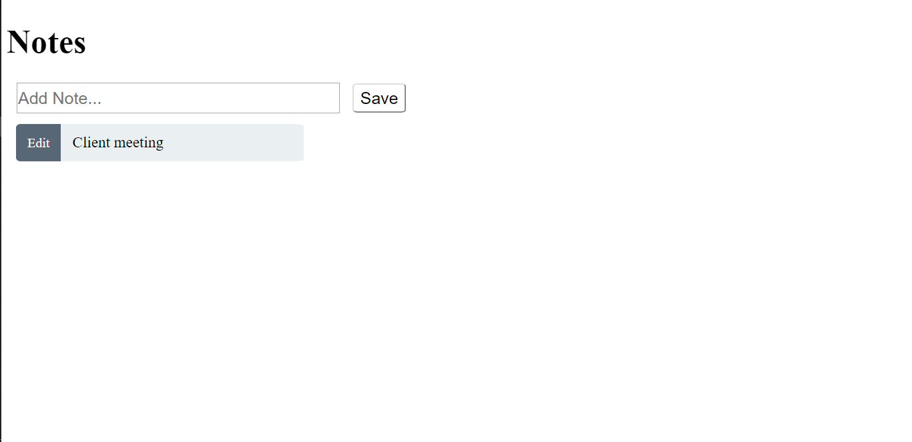
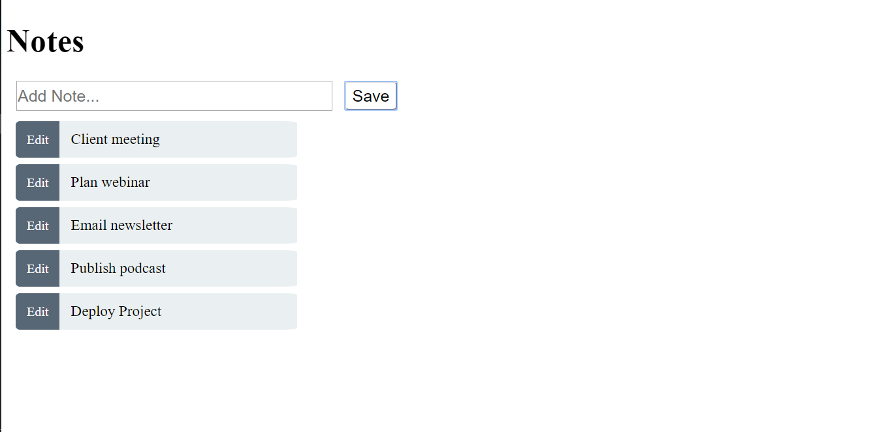
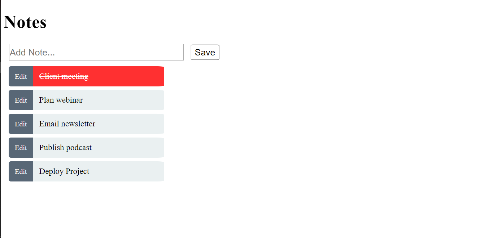
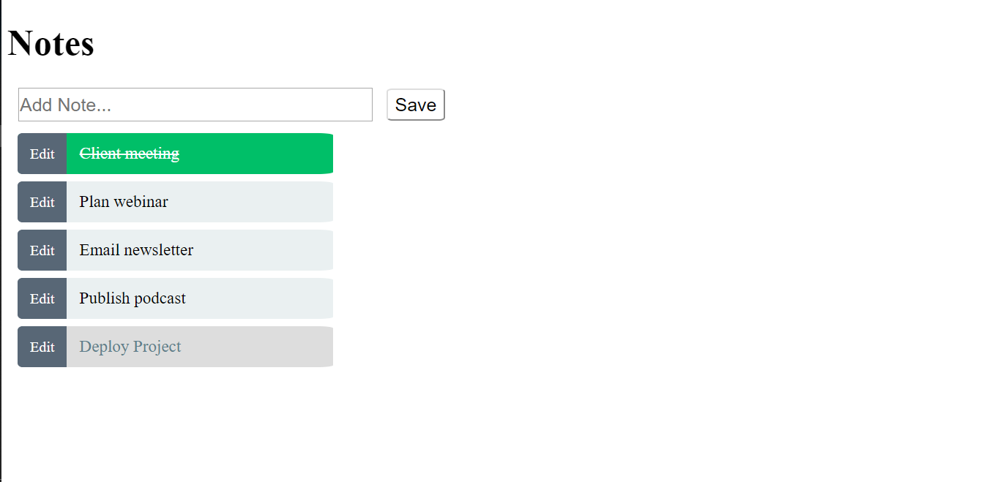
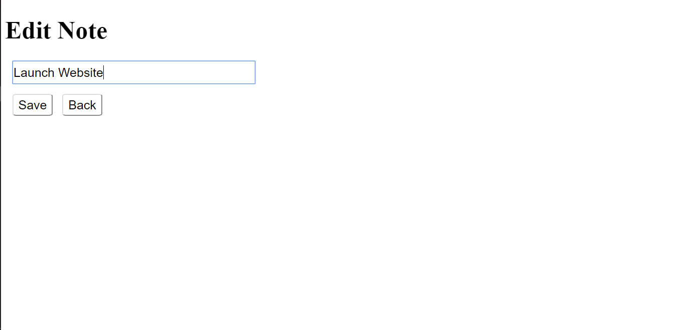
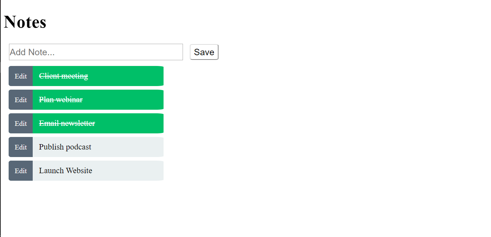

# TODO

This is an Angular Application designed to make note of todo items in a list, edit or change existing todo items and strike out completed todo items from the list.

## Notes Component

Here in this component it has a input textbox and save button in the view to get the todo item input from the user and push it to the data service array.It also displays all the todo items and an edit button which redirects to edit component.

## Edit Component

Here in this component we are provided with a view to modify the selected todo item and a back button to redirect back to notes component.

## Page Not Found Component

When user enters a invalid url it redirects to this component.

## Data Service

Data service stores all the todo list items.These todo items are accessed by the components which has subscribed to it.

## App Routing Module

In this module we specify all the paths in the application.Also have used a constant array variable to store list of components that are used in paths.so that we can add this constant to the app module declaration inspite of adding all the components individually in that constant array.

## Preview

